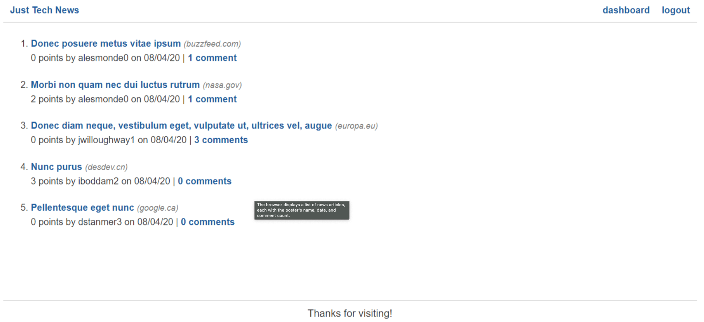

# Python-Newsfeed

  ## Description
  
  The app, called Just Tech News, lets users submit links to tech-related articles, comment on other users' articles, and upvote articles for points.

  ## Table of Contents
  
  - [Installation](#installation)
  - [Usage](#Usage)
  - [License](#License)
  - [Contributions](#Contributions)
  - [Tests](#Tests)
  - [Questions](#Questions)

  ## Installation
  
  How to install:
  fork the repo, clone it locally, and install the apps listed in the 'requirements.txt' file

  ## Usage
  
  Visit https://py-just-tech.herokuapp.com/ to use this app.
  
  

  ## License
  
  

  ## Badges

  
  

  ## Contributions
  
  Reach out to me!

  ## Tests
  
  Steps necessary to test:
  N/A

  ## Questions
  
  Feel free to reach out to me if you have any questions. Contact info below:
  - [GitHub](https:://github.com/Michael-Alvarado)
  - Email: alvaradomike5@gmail.com
